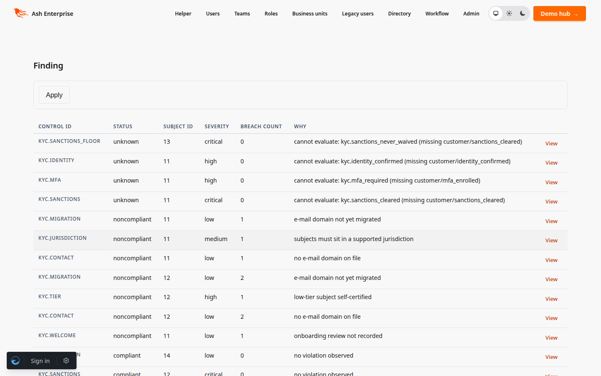
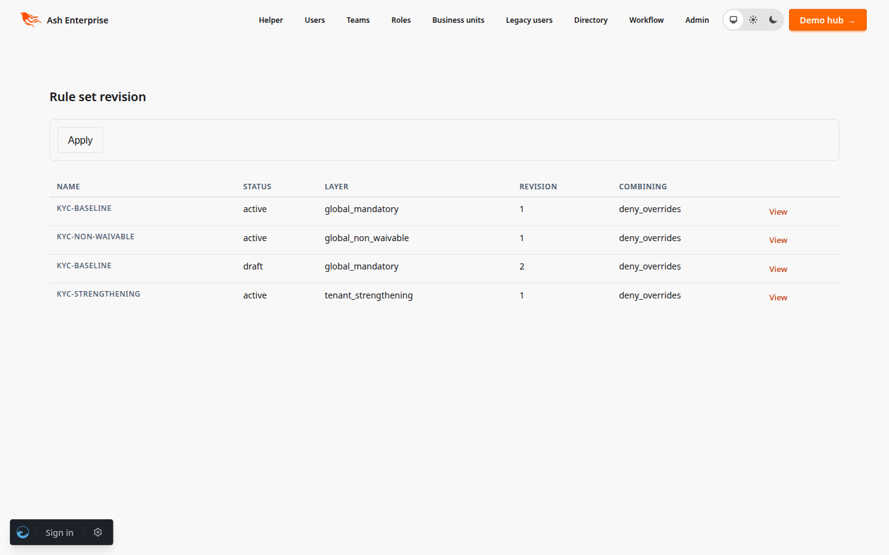
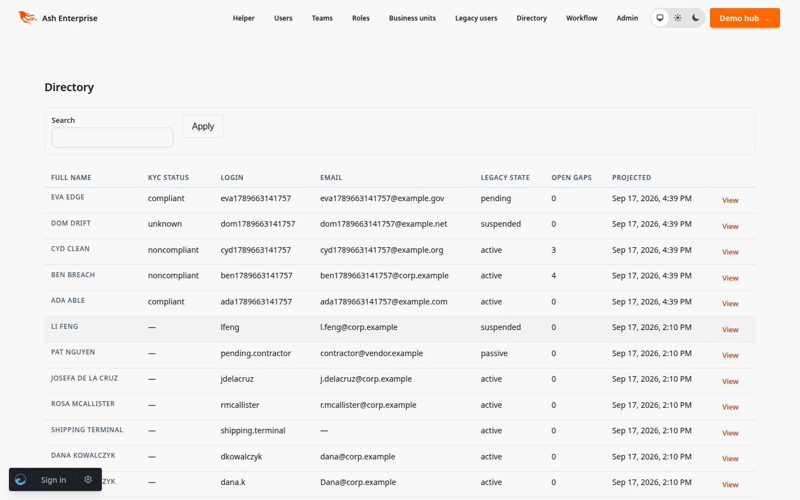

<!--
SPDX-FileCopyrightText: 2026 Luke Galea
SPDX-License-Identifier: MIT
-->

# AshCompliance

**Compliance is not a binder on a shelf — it is the answer to two questions
about every subject you serve: are they compliant right now, and what exactly
did the engine decide last Tuesday at 11:00?** Most teams answer neither: the
controls live in a spreadsheet, the enforcement lives in scattered code, and
the evidence that connects them lives in nobody's memory.

**AshCompliance is the control plane and the data plane, wired together by a
bundle hash.** Catalogs and profiles compile — through a fixed, non-negotiable
layering precedence — into immutable, content-hashed `ash_rules` bundles.
Findings project out of the event log onto per-subject rows. Every evaluation
is append-only, pinning the bundle revision, the fact snapshot and the
outcome: the auditor's truth, deliberately distinct from the projection.

---

## Why?

* **Rule changes must be events, not edits.** A compliance posture that
  changed silently is a compliance posture nobody can defend. Here, every
  effective rule set is a compiled, hash-pinned bundle; findings and
  evaluations reference the exact hash that produced them.
* **Tenant tailoring must be constrained.** "Each tenant tweaks the rules" is
  how a baseline dissolves. The layering precedence is fixed — non-waivable
  global > global mandatory > profile refinements > tenant strengthening >
  approved replacements/waivers > tenant supplements — and the compiler
  refuses ad-hoc inheritance, overreach and weakening that outranks nothing.
* **The finding and the decision must differ.** The projection answers "now";
  the `ComplianceEvaluation` record answers "why, with which facts, under
  which bundle". Conflating them is how audit trails die.
* **Missing evidence is never compliance.** The outcome lattice comes from
  `ash_rules`: `unknown` never collapses to `compliant`, and the data plane
  preserves that property end to end.

## How it fits

One compiler in the middle, one projector under it, and two artifacts that
must never be conflated:

```
   control plane                        the compile
┌──────────────────────────────┐
│ Catalog / Controls           │   non-waivable global
│ RuleSetRevisions (layers)    │     > global mandatory
│ Profiles (tailoring ops)     │     > profile refinements
│ Waivers (bounded, approved)  │     > tenant strengthening
│ TenantPolicySets             │     > approved overrides
└──────────────┬───────────────┘     > tenant supplements
               │  fixed precedence, refused overreach
               ▼
┌──────────────────────────────────────────────────────────┐
│ PolicyBundle — immutable, SHA-256 content-hashed,        │
│ validate-before-activate; the only thing that evaluates  │
└──────────────┬───────────────────────────────────────────┘
               │  hash pinned
               ▼
   data plane                          the projection
┌──────────────────────────────────────────────────────────┐
│ event log ──► Projector ──► Findings        (the "now")  │
│ (facts)     AshRules       ComplianceEvaluation        │
│                             (the "why" — append-only)   │
└──────────────────────────────────────────────────────────┘
```

The finding and the evaluation are deliberately different artifacts. The
projection answers "is this subject compliant today"; the evaluation log
answers "what did the engine decide, on which facts, under which bundle" —
and no code path rewrites either.

## What it looks like

Declare a rule set with `ash_rules` (its DSL, its verifiers), register it as
a revision, compile the tenant's bundle, and let the projector keep the
findings current:

```elixir
# One-time setup per tenant (see the layering topic for the full flow).
# Everything below goes through the AshCompliance.Domain code interfaces.
revision =
  AshCompliance.Domain.draft_rule_set_revision!(%{
    organization_id: org_id,
    name: "kyc-baseline",
    layer: :global_mandatory,
    rules_json: AshRules.Ir.encode!(MyApp.Compliance.Rules.__bundle__()),
    content_hash: MyApp.Compliance.Rules.__bundle__().content_hash
  })

revision
|> AshCompliance.Domain.validate_rule_set_revision!()
|> AshCompliance.Domain.approve_rule_set_revision!()
|> AshCompliance.Domain.activate_rule_set_revision!()

{:ok, bundle} =
  AshCompliance.Domain.compile_policy_bundle(%{organization_id: org_id})

AshCompliance.Domain.activate_policy_bundle!(bundle)
```

Then the projector keeps the findings current from your domain events:

```elixir
defmodule MyApp.ComplianceProjector do
  use AshCompliance.Projector,
    name: "compliance_findings_v1",
    event_log: MyApp.Events.Event,
    bundle: {__MODULE__, :active_bundle, []}

  grain fn event ->
    metadata = event.metadata || %{}

    %{
      organization_id: metadata["organization_id"],
      control_id: metadata["control_id"],
      subject_type: metadata["subject_type"],
      subject_id: metadata["subject_id"]
    }
  end

  project_all [:kyc_reviewed]

  def active_bundle(event) do
    # resolve the tenant's active PolicyBundle; see the how-it-works topic
  end
end
```

Every `kyc_reviewed` event hydrates the facts, evaluates the tenant's active
bundle, updates the finding (status, breach count, explanation, resolution
timestamps) and appends a `ComplianceEvaluation` — transactionally, with
checkpointing and dead-lettering handled by the projector engine.

## What ships

* **Control plane** — `Catalog`/`CatalogVersion`, `Control`/`ControlRevision`,
  `Profile`/`ProfileRevision` (tailoring operations stored as data),
  `RuleSetRevision` (draft → validated → approved → active → retired/revoked),
  `TenantPolicySet`, `PolicyOverride` (waivers with bounded time, approver and
  compensating controls), `ControlMapping`, and the immutable
  `PolicyBundle` with compile and validate-before-activate actions.
* **The layering compiler** — `AshCompliance.Compiler.compile/1`, fixed
  precedence, explicit per-layer combining, waiver expiry evaluated against
  the compile clock.
* **The projector** — `AshCompliance.Projector`, a macro over
  `ash_events_projections` providing the evaluator-to-ops translation; the
  host declares the grain. `Finding` is a ProjectionResource on the
  `[organization_id, control_id, subject_type, subject_id]` grain.
* **The auditor's truth** — `ComplianceEvaluation` (append-only) and
  `EvidenceArtifact` (immutable, hash + media type + collector + method +
  chain of custody + retention class).
* **OSCAL interop** — catalog and profile import/export via
  `AshCompliance.Oscal` and the `mix ash_compliance.import_oscal` /
  `mix ash_compliance.export_oscal` tasks.

There is deliberately **no API layer**: resources, actions, the compiler and
the projector only. Wire exposure is the host's concern. Every public action
is nonetheless exposed as a **code interface on `AshCompliance.Domain`**
(`record_evaluation/2`, `get_finding_by_id/2`, `active_policy_bundle/2`, the
bundle compile/activate/retire lifecycle, the OSCAL-facing reads, …) — hosts
and this package's own internals call those, never raw `Ash.create!` /
`Ash.Query` pipelines.

### On screen

The screenshots are the reference integration — customer KYC compliance in
`ash_enterprise` — running live, unmodified:



The status column is the outcome lattice on display. *Unknown* rows lead
because they are the interesting ones: sanctions screening has not cleared,
so the subject cannot be called compliant — and the "Why" column says
exactly which fact is missing.


Every evaluation pins the content hash of the bundle that produced it. An
auditor reconstructs any past decision from this table alone — no code path
rewrites it.



Layers are a property of the revision: the non-waivable floor, the mandatory
baseline (twice — revision 2 sits below as a draft, awaiting reviewed
activation), the tenant's strengthening set.



Findings project back onto the subject as plain calculations (`kyc_status`,
`compliant?`, `gap_count`) — no rules engine in the query path. The same
screen shows where each subject came from: the legacy estate's own rows,
projected through the strangler ledger.

### Policies and authorization (host-owned)

The package ships **no policy blocks**: which actor may waive which control
is a decision for the host, made by attaching `Ash.Policy.Authorizer` to the
resources it hosts. The seam is the `actor:`/`authorize?:` options every
domain interface, `AshCompliance.Oscal` function and
`AshCompliance.Testing.drain_sync/3` call accepts. Inside the package,
`authorize?: false` appears only in **trusted machinery** — the compiler
gather, the projector's evaluation write, the `set_active_bundle` check, and
the mix tasks — each with a justification comment at the site; none of them
carry a user request. If your policies must fire on those paths, that is a
design conversation, not a config flag.

### Tenancy (by explicit organization, by design)

These resources do **not** use Ash multitenancy (`strategy :attribute`).
Tenancy is carried by explicit `organization_id` attributes and per-
organization read actions (`active_rule_set_revisions`, `valid_policy_overrides`,
`findings_for_organization`, …), and on the data plane by the finding grain
`[organization_id, control_id, subject_type, subject_id]` itself. That is a
deliberate design: compliance rows must be queryable and referential across
tenants (shared catalogs with `organization_id: nil`, control mappings,
evidence), and schema-per-tenant style partitioning would fracture exactly
the joins the control plane exists for. Tenant isolation is asserted by the
compiler (an override for tenant A never reaches tenant B's compile) and by
the grain, not by a query filter bolted on at each call site.


## Installation

Not yet on Hex. As a git dependency:

```elixir
defp deps do
  [
    {:ash_compliance, github: "lukegalea/ash_compliance"}
  ]
end
```

Wire the repo and the projector engine:

```elixir
# config/config.exs
config :ash_compliance,
  repo: MyApp.Repo,
  projectors: [MyApp.ComplianceProjector]

config :ash_events_projections,
  repo: MyApp.Repo,
  pubsub: MyApp.PubSub,
  event_log: MyApp.Events.Event,
  projectors: [MyApp.ComplianceProjector]
```

Include `AshCompliance.Domain` in your Ash domains, add
`AshEvents.Projections.Supervisor` to your tree, and generate migrations for
the `ash_compliance_*` tables (the test suite's
`priv/test_repo/migrations` doubles as a reference schema).

## Development

The devenv Postgres listens on **5435**; tests default to it:

```bash
PGPORT=5435 mix test          # config/test.exs documents DB_HOST/DB_USER/DB_PASSWORD overrides
```

## Documentation

- [How it works](documentation/topics/how-it-works.md) — the two planes, the
  bundle lifecycle, the projector flow.
- [Layering and combining](documentation/topics/layering-and-combining.md) —
  the fixed precedence, what each layer may and may not do.
- [The projector](documentation/topics/the-projector.md) — grain, facts,
  translation, replay determinism.
- [OSCAL](documentation/topics/oscal.md) — catalog/profile import and export.
- [What it refuses](documentation/topics/what-it-refuses.md) — the compile
  and admission refusals, verbatim.

## Status

0.1.0. The compiler precedence, waiver semantics, projector translation and
the replay/tenant-isolation/unknown invariants are exercised against real
Postgres. The reference integration (customer KYC compliance) lives in
`ash_enterprise`.

## Contributing

Issues and PRs at [github.com/lukegalea/ash_compliance](https://github.com/lukegalea/ash_compliance).
`mix compile --warnings-as-errors`, `mix test`, `mix format --check-formatted`
and `mix credo --strict` must pass; CI runs all four.

Agents: read [AGENTS.md](AGENTS.md) before you change this repository. It links the agent constitution (`AGENT_PRINCIPLES.md`).

## License

MIT.
